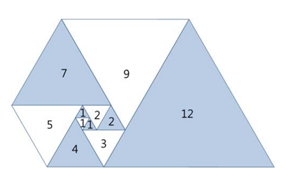

# 파도반 수열

## 문제


파도반 수열 P(N)은 나선에 있는 정삼각형의 변의 길이이다. P(1)부터 P(10)까지 첫 10개 숫자는 1, 1, 1, 2, 2, 3, 4, 5, 7, 9이다.

N이 주어졌을 때, P(N)을 구하는 프로그램을 작성하시오.

## 입력
첫째 줄에 테스트 케이스의 개수 T가 주어진다. 각 테스트 케이스는 한 줄로 이루어져 있고, N이 주어진다. (1 ≤ N ≤ 100)

## 출력
각 테스트 케이스마다 P(N)을 출력한다.

## 예제 입력 1
```
2
6
12
```

## 예제 출력 1
```
3
16
```
